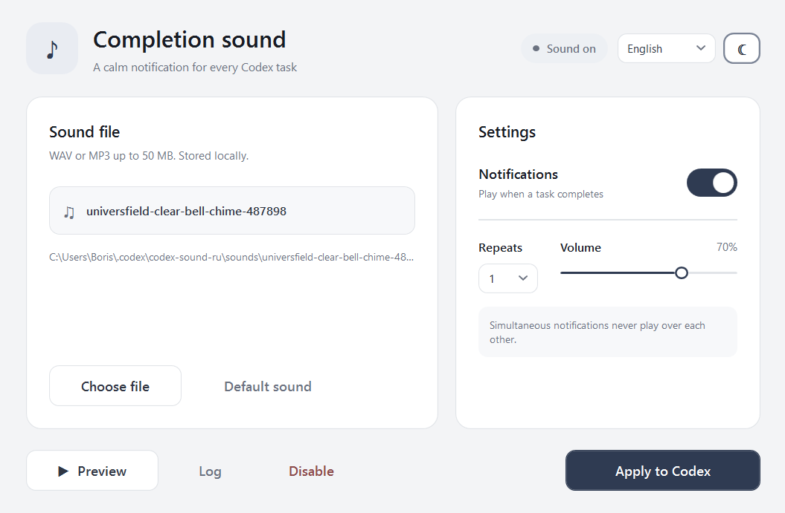

# Codex Completion Sound Manager

A lightweight Windows app that plays a custom sound after a Codex task is actually completed — not when you submit the prompt or when an ordinary turn-status notification arrives.



## Highlights

- Completion sounds for Codex tasks on Windows
- Semantic completion detection: only a successful `task_complete` record for the submitted turn can start the sound
- No sound when you submit a task, reconnect, or receive a normal intermediate turn notification
- A calm bundled completion sound that works immediately after installation
- WAV and MP3 support, with files stored locally
- Adjustable volume and repeat count
- Light and dark themes
- English, Russian, Spanish, German, and Simplified Chinese interfaces
- Protection against overlapping notifications
- Backs up `config.toml` and `hooks.json` before changing either file
- Preserves unrelated user hooks and restores the previous `notify` configuration when disabled
- No telemetry, network requests, accounts, or persistent background service

## Requirements

- Windows 10 or Windows 11
- Windows PowerShell 5.1
- Codex with a user configuration directory at `%USERPROFILE%\.codex`

## Quick start

1. Download this repository as a ZIP and extract it, or clone it with Git.
2. Run `Install.ps1`.
3. Open **Codex Completion Sound Manager** from the desktop shortcut.
4. Select **Preview** to hear the bundled sound, or choose your own WAV or MP3 file.
5. Select **Apply to Codex**.
6. Fully quit and reopen Codex once.
7. In **Settings → Hooks** (or `/hooks`), review and trust the two hooks installed by this app: `UserPromptSubmit` and `Stop`.

If Windows blocks the installer script, open PowerShell in the project folder and run:

```powershell
powershell.exe -NoProfile -ExecutionPolicy Bypass -File .\Install.ps1
```

The installer copies the app to:

```text
%USERPROFILE%\.codex\codex-completion-sound-manager\
```

It also creates a desktop shortcut. Existing installed files are backed up before they are replaced. The installer itself does not change Codex configuration; **Apply to Codex** does.

## Portable use

You can run the app directly without installing it:

```powershell
powershell.exe -NoProfile -ExecutionPolicy Bypass -STA -File .\CodexSoundManager.ps1
```

Keep the project folder in a stable location before selecting **Apply to Codex**, because Codex stores the absolute script path.

## How it works

Codex's public `notify` configuration reports that an agent turn ended. That is useful as a compatibility entry point, but it is not specific enough to distinguish a new prompt, a reconnect, or a real completed task. The manager therefore installs two local Codex hooks in `%USERPROFILE%\.codex\hooks.json`:

1. `UserPromptSubmit` records the session ID, turn ID, transcript path, and the byte position at which your task begins. It does not play sound.
2. `Stop` starts a short-lived local watcher. It reads only newer JSONL rows from that transcript and waits for a successful `task_complete` row with the same turn ID.
3. On that exact match, the hook starts the manager once with `--semantic-complete`, and the manager plays the selected sound.

The watcher exits after the completion is found, an error occurs, or 30 minutes pass. The settings window never needs to remain open.

The normal `notify` callback remains configured for compatibility, but is deliberately silent while semantic completion is enabled. This prevents the false sound that can otherwise appear right after a prompt is submitted.

Codex documents [hooks](https://learn.chatgpt.com/docs/hooks) as a trusted local extension mechanism. The transcript path is provided by Codex for hook use, but its JSON format is not a stable public interface; a major Codex change may require a manager update.

## Files and privacy

The app stores its data next to the installed script:

```text
settings.json       Local preferences
sounds\             Imported WAV and MP3 files
assets\default-sound.mp3  Bundled default completion sound
CodexCompletionHook.ps1   Local completion-verification hook
semantic-state\           Temporary per-turn IDs and offsets
semantic-completion.enabled Enables semantic completion mode
notifier.log        Local diagnostic log
playback.lock       Temporary overlap-protection lock
```

The hooks read the local Codex transcript only to locate a matching completion record after a task begins. They do not upload, transmit, or retain prompt text, API keys, or account information. `semantic-state` holds IDs, a local file path, a byte offset, and a timestamp; it contains no message body.

## Safety and recovery

- `config.toml` and `hooks.json` are backed up before every change made by this app.
- Existing hook entries are preserved. Disable removes only the manager's `UserPromptSubmit` and `Stop` command groups.
- An existing `notify` command is saved and restored on disable. It is not forwarded while semantic mode is enabled, to avoid reviving an old audio notification.
- Selecting **Disable** removes the semantic marker, its hook groups, and this manager's `notify` entry; it leaves unrelated configuration intact.
- Imported audio is copied into the app's local `sounds` directory, so deleting the original file does not break notifications.

## Uninstall

1. Open the manager and select **Disable** to restore the previous Codex notifier.
2. Close the manager.
3. Remove `%USERPROFILE%\.codex\codex-completion-sound-manager` and the desktop shortcut if you no longer need them.

## Credits

This is an independent PowerShell/WPF implementation. Its feature direction was inspired in part by the open-source [miao8818/codex-sound-manager](https://github.com/miao8818/codex-sound-manager) project.

The bundled **Clear Bell Chime** sound is by [Universfield](https://pixabay.com/users/universfield-28281460/) via [Pixabay](https://pixabay.com/sound-effects/film-special-effects-clear-bell-chime-487898/). See [Third-party notices](THIRD_PARTY_NOTICES.md).

## License

The application code is available under the [MIT License](LICENSE). The bundled audio is provided under the Pixabay Content License and is not covered by the MIT License; see [Third-party notices](THIRD_PARTY_NOTICES.md).
